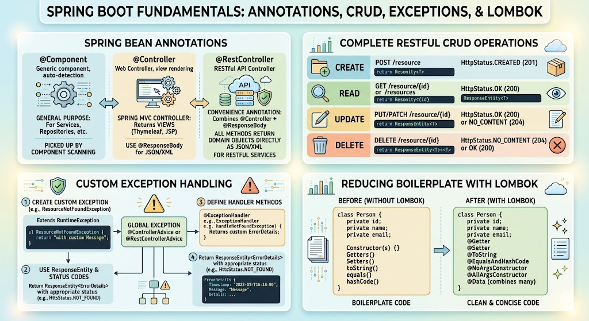

# [3.13] Web Service Development and API Design

## Lesson Overview

## Dependencies

- [Self Studies](./studies.md) / [Lesson](./lesson.md) / [Assignment](./assignment.md) / [Slide Deck](./slides.md)

## Lesson Objectives

By the end of this lesson, students will be able to:

* **Differentiate** between `@Component`, `@Controller`, and `@RestController` annotations
* **Implement** complete CRUD operations for REST resources using `ResponseEntity` with appropriate HTTP status codes
* **Create** and handle custom exceptions for better error management
* **Apply** Lombok annotations to reduce boilerplate code in POJOs

## Lesson Plan

| Duration | What | How or Why |
|---|---|---|
| 10 min | Warm-up | Recap REST design guidelines and `@GetMapping` / `@RequestParam` / `@PathVariable` from Lesson 3.11 — primes students for building on top of those patterns |
| 15 min | Part 1: `@Component`, `@Controller`, `@RestController` | Clarifies the annotation hierarchy; explains why `@RestController` = `@Controller` + `@ResponseBody` and when each is used |
| 20 min | Part 2: Create — `@PostMapping`, `@RequestBody`, UUID | Code-along — build the POST endpoint; demonstrate the problem without `@RequestBody` first, then fix it; add UUID auto-generation |
| 20 min | Part 2: Read — `GET /customers` and `GET /customers/{id}` | Code-along — preload data in constructor; build `getAllCustomers` and `getCustomer` with `getCustomerIndex` helper |
| 15 min | Part 2: Update + Delete — `@PutMapping`, `@DeleteMapping` | Code-along — complete the CRUD set; discuss PUT vs PATCH briefly |
| 15 min | Part 2: `ResponseEntity` and HTTP status codes | Explain why status codes matter; update `createCustomer` to return `201`; show alternate syntax |
| 10 min | Activity 1 — Update remaining endpoints with `ResponseEntity` | Students update GET, PUT, DELETE to return correct status codes independently |
| 5 min | `@RequestMapping` at class level | Quick refactor — move `/customers` prefix to class level to reduce repetition |
| 15 min | Part 2: Custom Exception — `CustomerNotFoundException` | Code-along — create exception class, update helper to throw instead of return `-1`, catch in handler methods |
| 10 min | Break | — |
| 20 min | Activity 2 — Build `Product` CRUD from scratch | Students independently build all 5 endpoints for a `Product` resource — consolidates everything learned |
| 15 min | Part 3: Lombok | Add Lombok dependency; apply `@Getter` and `@Setter` to `Customer`; observe the reduction in boilerplate |
| 10 min | Wrap-up | Recap CRUD pattern, `ResponseEntity`, custom exceptions, and Lombok; preview next lesson |
| **180 min** | **Total** | |